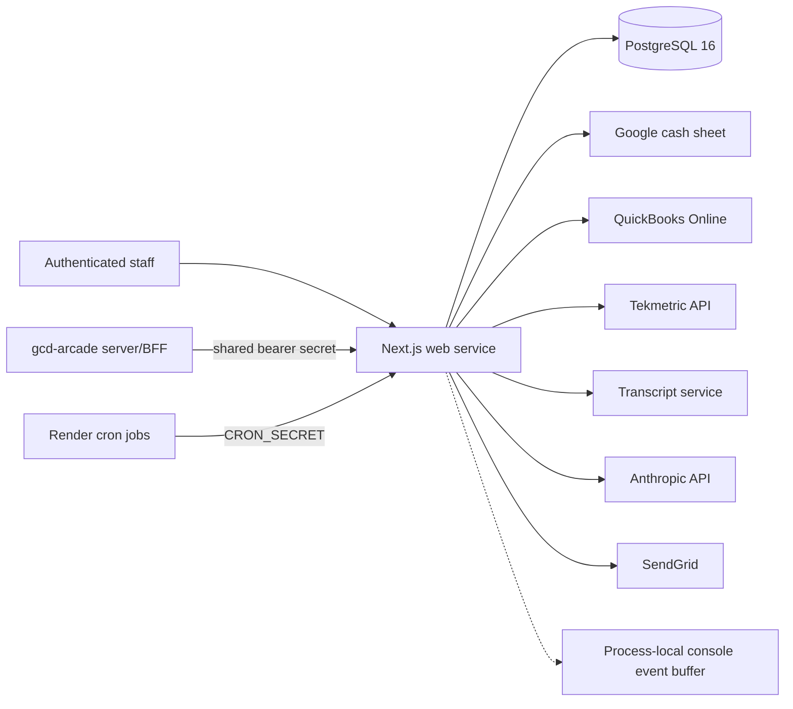

# GCD QBO Hub

GCD QBO Hub is the internal finance and operations dashboard for German Car Depot. It combines a production Cash Sheet Sync workflow with authenticated reporting, AI, coworker, deposit, check-reception, and Tekmetric modules. The repository root is the only active application tree.

**Current status (verified 2026-08-10):** Cash Sheet Sync is registered as `live`; the other six registered modules are marked `prototype` in source. “Prototype” does not mean harmless: Deposit Reconciliation and Check Reception can create real QuickBooks Online transactions when an authorized operator uses them with a live QBO connection. The checked-in Render blueprint describes production infrastructure, but this audit did not access Render, Intuit, Google, SendGrid, Anthropic, Tekmetric, or the transcript service to verify their current state.

## If you have to take over today

1. Check `/api/health` for process liveness, then sign in as an owner and inspect `/system-health` for persisted QBO, sync, Tekmetric, transcript, AI-budget, and alert state. Neither view performs live upstream checks.
2. Inspect the current rollout stage and QBO environment under Cash Sheet Sync settings before running any sync or creating deposits/checks.
3. Check the latest `SyncRun`, unresolved `Alert` records, failed/pending rows, QBO credential expiry, and the two Render cron jobs.
4. Confirm `MAGIC_LINK_DEBUG` is false and protect `/console/state` and `/console/stream` with a nonempty `CONSOLE_TOKEN`.
5. Confirm the shared `CRON_SECRET` and Arcade bridge secret match their callers. Never paste their values into an issue, log, or document.
6. Before changing schema or deployment state, take a database backup and verify where Render backups are retained. Restore has not been exercised from this repository.
7. Read [Operations](docs/OPERATIONS.md), [Security and continuity](docs/SECURITY_AND_CONTINUITY.md), and [Status](docs/STATUS.md) before intervening.

## Active repository map

| Path | Classification | Purpose |
|---|---|---|
| `src/app/` | Active | Next.js App Router pages, server actions, and route handlers |
| `src/lib/` | Active | Auth, QBO, Sheets, sync, AI, reporting, integration, and domain services |
| `prisma/` | Active, authoritative schema | PostgreSQL schema, migrations, and seed data |
| `tests/` | Active | Unit and integration-style tests run by Vitest |
| `scripts/` | Active operator tooling | Backfills and diagnostics; some call external systems |
| `render.yaml` | Active deployment declaration | Render web, two cron jobs, and PostgreSQL 16 |
| `docs/` | Current runbooks | Source-backed operating and subsystem documentation |
| `docs/archive/` | Historical only | Superseded progress and handoff records; never operating instructions |

There is no second app tree, worker process, Redis instance, or durable queue in this repository. Next.js serves the UI and APIs in one process. Console events use a process-local in-memory ring buffer and disappear on restart.

## Architecture and data flow



- Google Sheet rows enter Cash Sheet Sync, are normalized and persisted, matched against QBO, reviewed, then conditionally posted. Persisted rows, events, sync runs, mappings, transactions, and alerts form the audit trail.
- QBO is both a read source and a write destination. Cash Sheet Sync can create expenses/transfers; Deposit Reconciliation can create deposits; Check Reception can create checks. Existing QBO objects are not automatically edited or deleted by these workflows.
- QBO reports, Tekmetric snapshots, transcript aggregates, scenarios, and AI outputs feed projections and assistant views. AI requests can incur cost and persist conversations/reports.
- Coworker Portal imports a configured QBO account into questions, stores answers, and can send notifications.
- Arcade calls the `/api/external/*` surface through its own server-side bridge. Those requests use one shared service identity, not the end user's hub role.

See [Architecture](docs/ARCHITECTURE.md) and [Data model](docs/DATA_MODEL.md) for ownership, invariants, and detailed flows.

## Runtime components and schedules

| Component | Entry point | Trigger |
|---|---|---|
| Web UI and APIs | `npm run start` / `src/app/` | HTTP |
| Daily cash-sheet cron | `POST /api/cron/sync` | Render schedule `0 23 * * *` |
| Monthly AI council | `POST /api/cron/ai-council` | Render schedule `0 6 1 * *` |
| PostgreSQL | Prisma client and migrations | Web process and deploy migration command |

Render schedules are UTC. The daily job therefore runs at 19:00 Eastern during daylight time and 18:00 Eastern during standard time. It runs every day, including weekends. The route derives mode and rollout stage from the database; do not infer live-write safety from the cron command.

## Application and HTTP surface

Registered modules are Cash Sheet Sync (`live`), Financial Projections, AI Report Assistant, Coworker Portal, Deposit Reconciliation, Check Reception, and Tekmetric Operations (all `prototype`). `/system-health` is an owner-only read of persisted state. A financial-report library and database snapshot/capability models also exist, but there is no registered Financial Reports module or `/financial-reports` page; treat that work as incomplete.

Public or separately authenticated routes:

- `/api/health` is public liveness only.
- `/api/auth/*`, `/auth/*`, and legal pages support login and policy display.
- `/api/qbo/connect` and `/api/qbo/callback` implement the authorized OAuth flow.
- `/api/cron/*` requires `Authorization: Bearer <CRON_SECRET>` and fails closed when unset.
- `/api/external/*` requires `ARCADE_BRIDGE_SECRET` and fails closed when unset. Its assistant POST can incur AI cost and persist data; reporting POST forces a live QBO report refresh.
- `/console/manifest` is public with permissive CORS. `/console/state` and `/console/stream` are protected only when `CONSOLE_TOKEN` is nonempty; the query-string `key` fallback can leak via request logs. Console telemetry is operationally sensitive.

## Authentication and trust boundaries

NextAuth email magic links use SendGrid. Allowed domains come from `ALLOWED_EMAIL_DOMAINS`; the exact `BOOTSTRAP_OWNER_EMAIL` is provisioned as `owner_admin` on first sign-in. Roles are `owner_admin`, `reviewer`, and `coworker`, with server-side permission checks defined in `src/lib/auth/roles.ts`. QBO OAuth credentials are encrypted in PostgreSQL with AES-256-GCM using `APP_ENCRYPTION_KEY`.

The cron, Arcade, and console shared secrets are separate machine trust boundaries and do not carry a human user's role. `MAGIC_LINK_DEBUG=true` prints a one-time login credential to logs and must be a short-lived recovery measure only.

## Local development

Requires Node 20 or newer, npm, and PostgreSQL.

```bash
npm ci
cp .env.example .env.local
npm run prisma:generate
npm run prisma:migrate
npm run dev
```

Use sandbox or fake integration accounts. Missing credentials should be preferred over production credentials during local setup. Do not run backfill, diagnostics, seed, migration, or posting commands against an unidentified database.

Validation for a normal change:

```bash
npm test
npm run typecheck
npm run lint
npm run build
npm audit --omit=dev
git diff --check
```

See [Testing](TESTING.md) for test boundaries and [Contributing](CONTRIBUTING.md) for the definition of done.

## Deploy, migrate, recover, and roll back

`render.yaml` declares one Node web service, two Node cron services, and PostgreSQL 16. The web build currently runs `npm install`, build, and `prisma migrate deploy` in sequence. Review pending migrations and back up first: a failed migration can leave a release partially applied. Application rollback is a Render release/commit rollback; database rollback is forward repair or verified restore, because Prisma migrations have no automatic down path.

No checked-in backup job, restore drill, infrastructure state, or CI workflow was found. The actual Render service settings, custom domains, backup retention, deploy hooks, and manual dashboard variables remain external state. Procedures and limitations are in [Operations](docs/OPERATIONS.md).

## Known risks and immediate follow-ups

- Console state/stream fail open when `CONSOLE_TOKEN` is unset; the manifest is always public.
- Deposit and check modules are labelled prototypes but contain real QBO create actions.
- Arcade's shared bridge identity bypasses per-human hub authorization and can trigger cost/persistence.
- The daily UTC schedule shifts one hour in local wall time across DST.
- Health checks are persisted-state/liveness checks, not end-to-end upstream probes.
- No CI, automated backup, restore drill, or documented external ownership register is checked in.
- Production infrastructure and dashboard configuration were not verified during this repository-only audit.
- Dependency-audit and full validation results are tracked in [Status](docs/STATUS.md).

## Documentation source of truth

Executable source, tests, migrations, and checked-in configuration define behavior. This README is the canonical zero-context handoff. Current runbooks are [Architecture](docs/ARCHITECTURE.md), [Operations](docs/OPERATIONS.md), [Integrations](docs/INTEGRATIONS.md), [Data model](docs/DATA_MODEL.md), [Environment](docs/ENVIRONMENT.md), [Security and continuity](docs/SECURITY_AND_CONTINUITY.md), and [Status](docs/STATUS.md). Subsystem notes remain under `docs/`; historical records are indexed in [the archive](docs/archive/README.md).

**Documentation is part of every change.** A change is incomplete until all affected documentation, environment examples, commands, diagrams, operational notes, and external-setup descriptions are updated and verified in the same atomic change. The binding rule is in [AGENTS.md](AGENTS.md).
